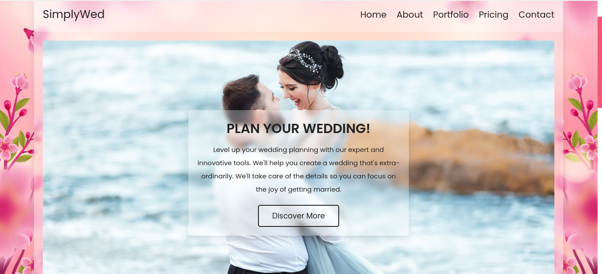
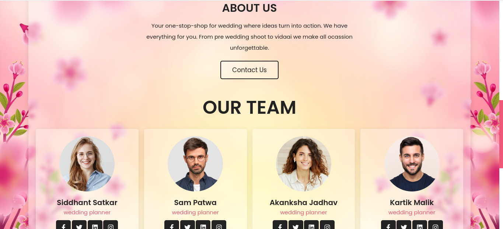
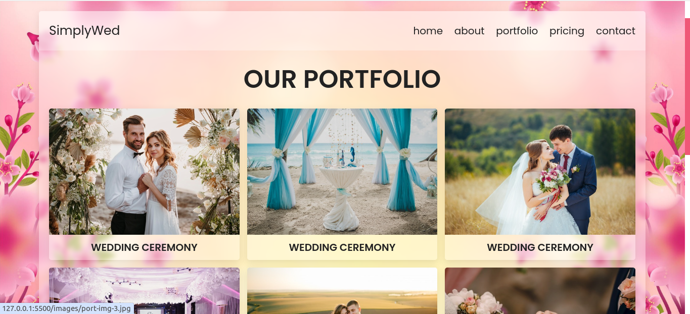
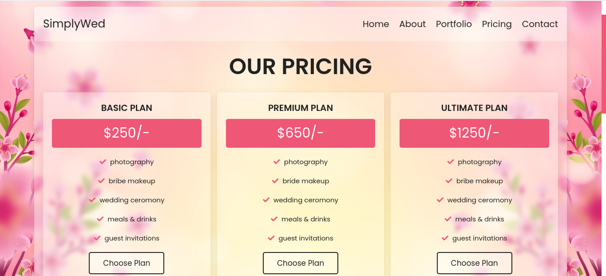
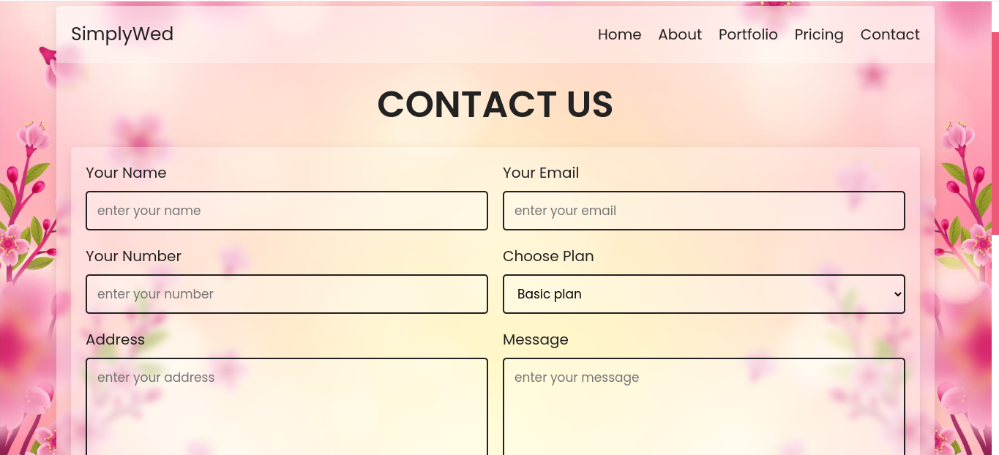

# Wedding Planner

## Description

This project is a user-friendly wedding planning application built using HTML, CSS, and PHP. 
It streamlines the wedding planning process by providing a central location to manage tasks, vendors, budget, and guest lists. 
Users can create an account to access and personalize their wedding plans. 

## Technologies Used

* Front-End:
    * HTML
    * CSS 
* Back-End:
    * PHP (for database connectivity)

## Features

* **Task Management:** Create, manage, and track wedding-related tasks with customizable due dates and priorities.
* **Vendor Management:** Add, edit, and contact vendors with detailed information for easy reference.
* **Budget Management:** Create a budget for various wedding expenses and track spending efficiently.
* **Guest List Management:** Add, edit, and RSVP features for guests.

## Video

[https://drive.google.com/file/d/15gACQOcUrs1RFpFCus5R-nXQBiAK-k3S/view?usp=sharing]

## Screenshots 

Add brief descriptions below each image:

1. **Dashboard:** 
2. **About us:** 
3. **Portfolio:** 
4. **Pricing:** 
5. **Contact:** 
